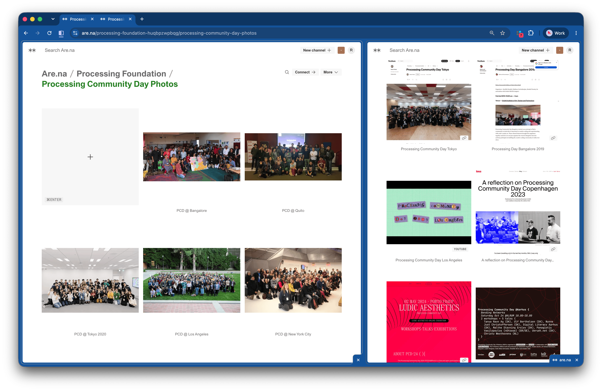

We encourage you to document your event and **publish a short written blog post as a recap**. 

For inspiration, I recommend looking at [this recap from PCD @ Bristol 2019](https://web.archive.org/web/20231209011044/https://www.beccarose.co.uk/pcd-bristol-2019/) by [Becca Rose](https://www.beccarose.co.uk/). It shares how the team organized the event, what the schedule looked like, resources they had access to, how much everything cost, unexpected challenges they faced, what they'd do differently, promotional material they used, the kind of people who attended, and detailed workshop formats that others can reuse. 

You do not need to document your event in exactly the same way, but what I like about the above recap is how thorough and transparent it is. Many PCD organizers are hosting a public event for the first time. For them, having access to detailed first-hand accounts like this is especially valuable. Think of this blog post as a gift you are giving to future organizers and the wider community.

Include your best photos too! See [Taking Photos](../organizer-kit/resources/taking-photos.md) for tips on photographing your PCD event.

For more inspiration, you can find documentation from past events in the following Are.na channels: 

- [Processing Community Day Recaps](https://www.are.na/processing-foundation-huqbpzwpbqg/processing-community-day-recaps) 
- [Processing Community Day Photos](https://www.are.na/processing-foundation-huqbpzwpbqg/processing-community-day-photos). 

After your event, **please share your documentation to these same Are.na channels**. This helps us build a shared record of Processing Community Day and makes it easier to look back at what happened across local communities year after year.

If Processing or p5.js projects were created or presented during your event, you can also share them in our project channels [Powered by Processing (Java)](https://www.are.na/processing-foundation-49e0uryu3lq/powered-by-processing-java) and [Powered by p5.js](https://www.are.na/processing-foundation-49e0uryu3lq/powered-by-p5-js). Note that projects shared on Are.na may also be featured on the [Processing Foundation showcase page](https://processingfoundation.org/software/showcase/).

Screenshot of Are.na channels showing Processing Community Day Recaps and Photos.